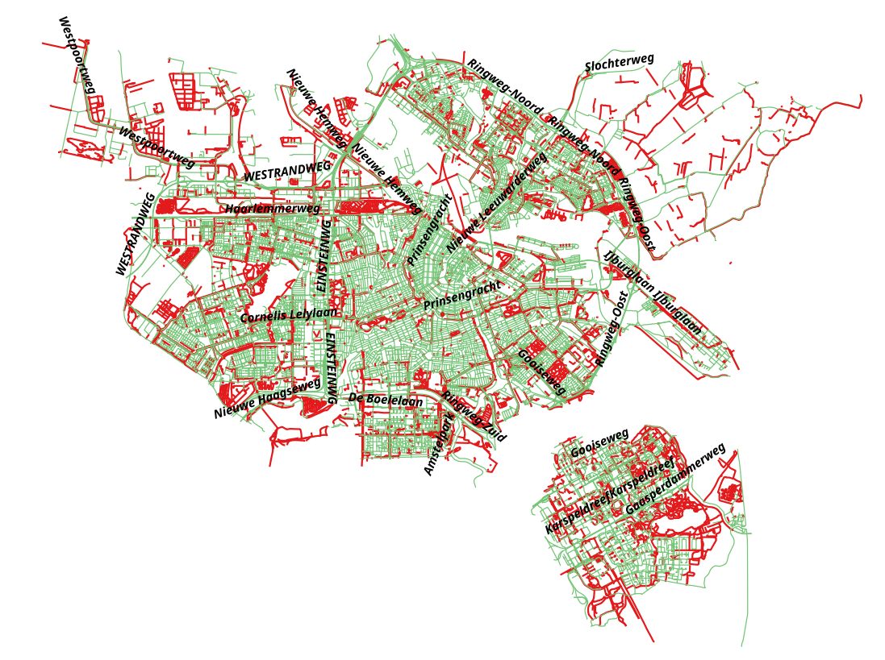
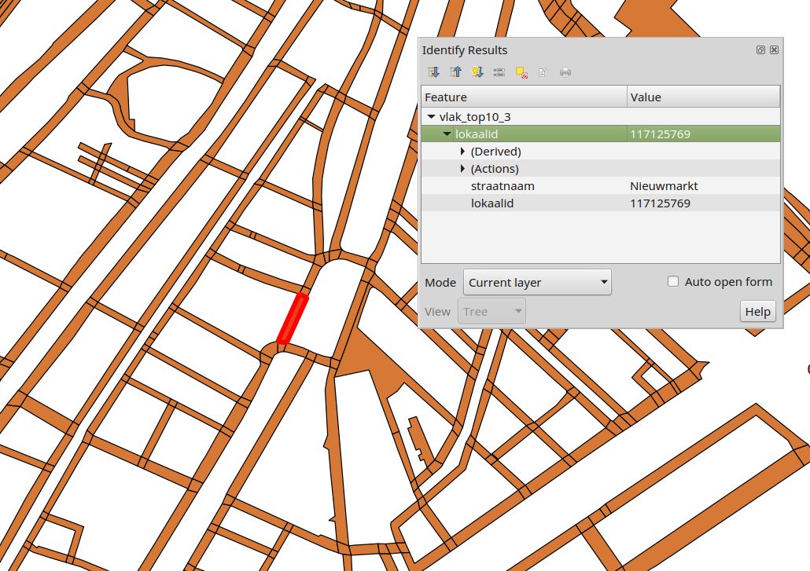
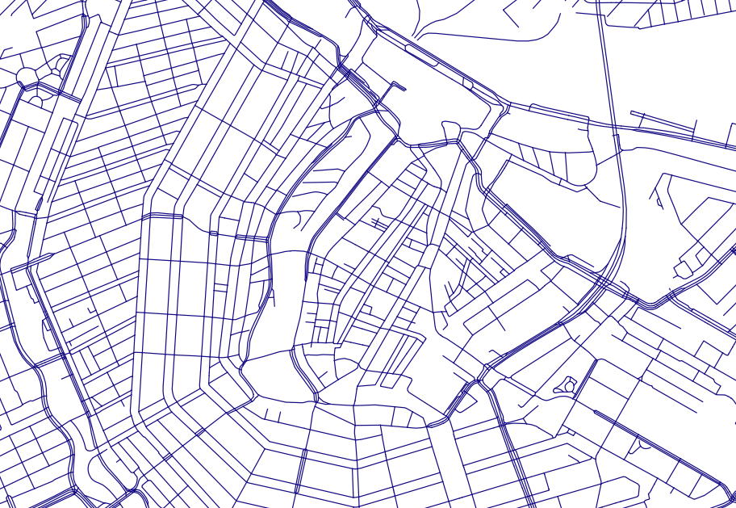

# atlas_kbk
Atlas import docker for Kleinschalige Basiskaart 10 and Kleinschalige Basiskaart 50

# Straatnamen

Straatnamen aan Top10NL hartlijnen toekennen voor betere visualisatie op de referentiekaart van gemeente Amsterdam Datapunt.

**Contents:**
1. Resultaat
2. Loading Data
3. Pre-processing - Clip op Amsterdam
4. Van NWB naar Top10NL_wegdeel_vlak
5. Van Top10NL_wegdeel_vlak naar Top10Nl_wegdeel_hartlijn
5. Top10NL_hartlijn topology verbeteren
6. Hartlijn_clean straatnamen uitbereiden naar doorlopende straten 
7. Hartlijn_clean uitbereiden met lengte

## 1. Resultaat

Uiteindelijke bestand met hartlijnen (Top10NL) samengevoegd op straatnaam en typeweg.

**Meest belangrijke atributten:**

- straatnaam (NWB)
- typeweg (TOP10NL)
- typeinfrastructuur (TOP10NL)
- hoofdverkeersgebruik (TOP10NL)
- verhardingsbreedteklasse (TOP10NL)
- lengte: lengte van alle lijnen met dezelfde straatnaam (berekend)
- lengte_ind: De individuele lengte van de lijnen (berekend)

rood = GEEN straatnaam

## 2. Loading Data

#### Source DataSets

- NWB wegvakken
- TOP10NL Wegdeel_vlak
- TOP10NL Wegdeel_hartlijn
- TOP10NL Registratiefgebied

## 3. Pre-processing

NWB kan ge-clipped worden door gemeentenaam te gebruiken. Ook worden alle bruggen niet mee genomen. Top10NL hartlijnen moeten worden ge-clipped met de Top10NL registratiefgebied polygonen op basis van de gemeentenaam.

## 4. Van NWB naar Top10NL_wegdeel_vlak

Top10NL Vlakken met de Straatnaam van de NWB lijn die er het meeste in voorkomt

#### Voeg aan (ams_vlak) de straatnamen van het NWB toe op Intersect met de lengte van de intersectie (result: per lijn een geometry vlak)
De NWB wordt ge-intersect met de Top10NL_wegdeelVlakken, het resultaat is per intersectie een wegdeel vlak met de lengte van het stuk lijn wat intersect. Dit betekent, dat er meerde dezelfde polygonen over elkaar liggen met mogelijke andere straatnamen. bv. Op een kruising overlappen 4 verschillende straatnamen (NWB-lijnen) het zelfde wegdeel_vlak polygoon. 

#### Bereken de lengte van de lijn die intersect met dezelfde straatnaam.
Als dezelfde straatnaam meerdere keer voorkomt in een wegdeel_vlak polygoon van hetzelfde idnummer, dan wordt de lengte van de NWB-lijn bij elkaar opgeteld. 

#### Neem alleen de naam van de max(lengte)

Van de overlappende wegdeel_vlak polygonen met dezelfde ID word alleen de polygoon gehouden met de grootste lengte van de NWB lijn. Hierdoor krijgt het vlak de straatnaam van de NWB-lijn die het meest voorkomt in dat vlak.

## 5. Van Top10NL_wegdeel_vlak naar Top10Nl_wegdeel_hartlijn

#### Left Outer Join hartlijn met vlak door lokaalid
De Top10NL_wegdeel_hartlijn krijgt de straatnaam van het wegdeel_vlak met dezelfde lokaalID.

Resultaat: 

# 6. Top10NL_hartlijn topology verbeteren

Voor meer informatie zie:  
[Postgis Topology](https://trac.osgeo.org/postgis/wiki/UsersWikiPostgisTopology)  
[Blog clean up road networks](http://blog.mathieu-leplatre.info/use-postgis-topologies-to-clean-up-road-networks.html)

1. Creer de topology
2. Maak van de topology geometry een gewone geometry met de atributen van de orginele data. 

# 7. Hartlijn_clean straatnamen uitbereiden naar doorlopende straten 

#### Lijnen opknippen
Maak punten van de lijnen. 

#### Functie voor splitten van lijnen door multipoints
[Link naar stackexchange](http://gis.stackexchange.com/questions/112282/split-lines-into-non-overlapping-subsets-based-on-points)

#### Functie aanroepen met lijnen en punten
De hartlijnen worden opgeknipt in kleinere stukjes (met eigen breek-punten). Hierdoor wordt in de volgende stap elke doorlopende lijn meegenomen. 

#### In het verlengde liggende straten zonder naam aan de straat toevoegen (minder dan 10 graden hoek!)
De straten zonder naam die in het verlengde liggen van een straat met naam (en dezelfde eigenschappen) krijgen dan die naam.
Doordat de lijnen zijn opgeknip in kleinere stukjes, kan er beter worden gekeken welke doorloopt. Want straten met een hoek erin worden anders niet meegenomen. In latere stappen wordt dit weer samengevoegd.

#### Orgineel bestand en stukje met nieuwe naam samenvoegen
De lijnen met nieuwe namen worden bij het oude bestand toegevoegd.

#### Laatste 2 stappen herhalen!
De laatste 2 stappen worden herhaald om nog meer in het verlengde liggende stukjes te benoemen.

# 8. Hartlijn_clean uitbereiden met lengte

####  Voeg lijnen die aan elkaar liggen met dezelfde naam samen
Als de lijnen dezelfde straatnaam hebben en dezelfde eigenschappen kunnen ze weer samengevoegd worden. Zo krijgen we voor elke straat 1 doorlopende lijn.

#### Lengte per lijn toevoegen
De lengte van de straat wordt toegevoegd. Voor het visualiseren is dit een belangrijk attribuut.

# Bronnen overige kaartteksten

- Huisnummers: BGT nummeraanduidingreeks
- Waternamen grootschalig: BGT openbareruimtelabel
- Waternamen kleinschalig: [TopNamen](http://www.kadaster.nl/-/topnamen)
- Parken: Top10NL functioneelgebied (punt)
- Dierentuinen: Top10NL functoneelgebied (vlak)
- Stations: [NGR](http://nationaalgeoregister.nl/geonetwork/srv/search/?uuid=2768fd98-3d2a-4790-886c-7435fc0ad4f6)
- Plaatsnamen: Top10NL plaats (vlak)

## Bijwerkingscycli

- BGT wordt dagelijks bijgewerkt in de LV-BGT.
- Top10NL wordt 5x per jaar bijgewerkt door het Kadaster, maar hooguit 1x per jaar wordt grondgebied gemeente A'dam bijgewerkt
- TopNamen stamt uit 2013. 
- Bron van stations is PDOK, maar onduidelijk wie de eigenaar is.
